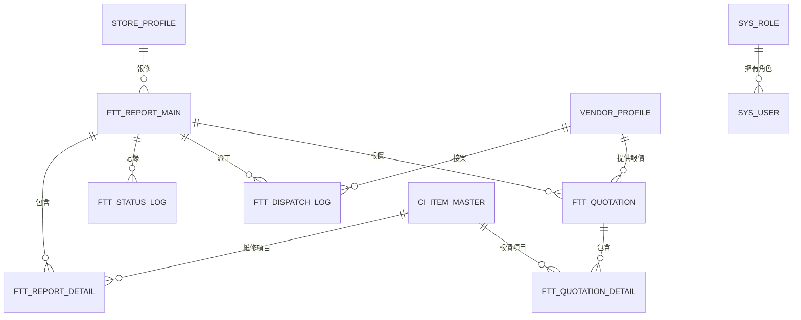

# 資料庫架構說明

## 資料庫概述

FTT 系統使用 PostgreSQL 作為主要資料庫，採用關聯式資料庫設計，支援完整的 ACID 特性。

### 資料庫資訊
- **資料庫名稱**: `infwf`
- **版本**: PostgreSQL 12+
- **字元編碼**: UTF-8
- **時區**: Asia/Taipei
- **連線資訊**: 
  - **伺服器**: 10.64.35.138
  - **埠號**: 5444
  - **使用者**: ftt
  - **連線逾時**: 86400 秒 (24 小時)

## 核心資料表結構

### 1. 報修單相關表格

#### 1.1 報修主檔 (FTT_REPORT_MAIN)
```sql
CREATE TABLE ftt_report_main (
    report_id SERIAL PRIMARY KEY,
    form_no VARCHAR(50) NOT NULL UNIQUE,
    store_code VARCHAR(20) NOT NULL,
    store_name VARCHAR(100),
    report_type VARCHAR(10),
    priority_level INTEGER DEFAULT 1,
    status VARCHAR(20) DEFAULT 'NEW',
    create_user VARCHAR(50),
    create_time TIMESTAMP DEFAULT CURRENT_TIMESTAMP,
    update_user VARCHAR(50),
    update_time TIMESTAMP DEFAULT CURRENT_TIMESTAMP,
    is_deleted CHAR(1) DEFAULT 'N'
);

-- 索引
CREATE INDEX idx_ftt_report_main_form_no ON ftt_report_main(form_no);
CREATE INDEX idx_ftt_report_main_store_code ON ftt_report_main(store_code);
CREATE INDEX idx_ftt_report_main_status ON ftt_report_main(status);
CREATE INDEX idx_ftt_report_main_create_time ON ftt_report_main(create_time);
```

#### 1.2 報修明細 (FTT_REPORT_DETAIL)
```sql
CREATE TABLE ftt_report_detail (
    detail_id SERIAL PRIMARY KEY,
    report_id INTEGER NOT NULL,
    ci_item_id INTEGER,
    ci_item_name VARCHAR(200),
    quantity INTEGER DEFAULT 1,
    unit_price DECIMAL(10,2),
    total_price DECIMAL(10,2),
    description TEXT,
    create_time TIMESTAMP DEFAULT CURRENT_TIMESTAMP,
    FOREIGN KEY (report_id) REFERENCES ftt_report_main(report_id)
);

-- 索引
CREATE INDEX idx_ftt_report_detail_report_id ON ftt_report_detail(report_id);
CREATE INDEX idx_ftt_report_detail_ci_item_id ON ftt_report_detail(ci_item_id);
```

#### 1.3 狀態異動記錄 (FTT_STATUS_LOG)
```sql
CREATE TABLE ftt_status_log (
    log_id SERIAL PRIMARY KEY,
    report_id INTEGER NOT NULL,
    from_status VARCHAR(20),
    to_status VARCHAR(20) NOT NULL,
    action_user VARCHAR(50),
    action_time TIMESTAMP DEFAULT CURRENT_TIMESTAMP,
    remark TEXT,
    FOREIGN KEY (report_id) REFERENCES ftt_report_main(report_id)
);

-- 索引
CREATE INDEX idx_ftt_status_log_report_id ON ftt_status_log(report_id);
CREATE INDEX idx_ftt_status_log_to_status ON ftt_status_log(to_status);
CREATE INDEX idx_ftt_status_log_action_time ON ftt_status_log(action_time);
```

### 2. 門市相關表格

#### 2.1 門市主檔 (STORE_PROFILE)
```sql
CREATE TABLE store_profile (
    store_id SERIAL PRIMARY KEY,
    ivr_code VARCHAR(20) NOT NULL UNIQUE,
    shop_name VARCHAR(100) NOT NULL,
    company_leaves VARCHAR(50),
    channel VARCHAR(50),
    store_type VARCHAR(50),
    area VARCHAR(50),
    owner_name VARCHAR(50),
    as_name VARCHAR(50),
    owner_tel VARCHAR(20),
    urgent_tel VARCHAR(20),
    address VARCHAR(200),
    is_active CHAR(1) DEFAULT 'Y',
    create_time TIMESTAMP DEFAULT CURRENT_TIMESTAMP,
    update_time TIMESTAMP DEFAULT CURRENT_TIMESTAMP
);

-- 索引
CREATE INDEX idx_store_profile_ivr_code ON store_profile(ivr_code);
CREATE INDEX idx_store_profile_shop_name ON store_profile(shop_name);
CREATE INDEX idx_store_profile_area ON store_profile(area);
```

### 3. 廠商相關表格

#### 3.1 廠商主檔 (VENDOR_PROFILE)
```sql
CREATE TABLE vendor_profile (
    vendor_id SERIAL PRIMARY KEY,
    vendor_code VARCHAR(20) NOT NULL UNIQUE,
    vendor_name VARCHAR(100) NOT NULL,
    contact_person VARCHAR(50),
    contact_phone VARCHAR(20),
    contact_email VARCHAR(100),
    service_area VARCHAR(200),
    speciality TEXT,
    rating DECIMAL(3,2),
    is_active CHAR(1) DEFAULT 'Y',
    create_time TIMESTAMP DEFAULT CURRENT_TIMESTAMP,
    update_time TIMESTAMP DEFAULT CURRENT_TIMESTAMP
);

-- 索引
CREATE INDEX idx_vendor_profile_vendor_code ON vendor_profile(vendor_code);
CREATE INDEX idx_vendor_profile_vendor_name ON vendor_profile(vendor_name);
CREATE INDEX idx_vendor_profile_is_active ON vendor_profile(is_active);
```

#### 3.2 派工記錄 (FTT_DISPATCH_LOG)
```sql
CREATE TABLE ftt_dispatch_log (
    dispatch_id SERIAL PRIMARY KEY,
    report_id INTEGER NOT NULL,
    vendor_id INTEGER,
    dispatch_time TIMESTAMP DEFAULT CURRENT_TIMESTAMP,
    expected_date DATE,
    dispatch_user VARCHAR(50),
    status VARCHAR(20) DEFAULT 'ASSIGNED',
    accept_time TIMESTAMP,
    reject_reason TEXT,
    FOREIGN KEY (report_id) REFERENCES ftt_report_main(report_id),
    FOREIGN KEY (vendor_id) REFERENCES vendor_profile(vendor_id)
);

-- 索引
CREATE INDEX idx_ftt_dispatch_log_report_id ON ftt_dispatch_log(report_id);
CREATE INDEX idx_ftt_dispatch_log_vendor_id ON ftt_dispatch_log(vendor_id);
CREATE INDEX idx_ftt_dispatch_log_status ON ftt_dispatch_log(status);
```

### 4. 維修品項相關表格

#### 4.1 維修品項主檔 (CI_ITEM_MASTER)
```sql
CREATE TABLE ci_item_master (
    item_id SERIAL PRIMARY KEY,
    item_code VARCHAR(50) NOT NULL UNIQUE,
    item_name VARCHAR(200) NOT NULL,
    parent_id INTEGER,
    category VARCHAR(50),
    unit VARCHAR(20),
    standard_price DECIMAL(10,2),
    is_active CHAR(1) DEFAULT 'Y',
    sort_order INTEGER DEFAULT 0,
    create_time TIMESTAMP DEFAULT CURRENT_TIMESTAMP,
    FOREIGN KEY (parent_id) REFERENCES ci_item_master(item_id)
);

-- 索引
CREATE INDEX idx_ci_item_master_item_code ON ci_item_master(item_code);
CREATE INDEX idx_ci_item_master_item_name ON ci_item_master(item_name);
CREATE INDEX idx_ci_item_master_parent_id ON ci_item_master(parent_id);
CREATE INDEX idx_ci_item_master_category ON ci_item_master(category);
```

### 5. 報價相關表格

#### 5.1 報價主檔 (FTT_QUOTATION)
```sql
CREATE TABLE ftt_quotation (
    quotation_id SERIAL PRIMARY KEY,
    report_id INTEGER NOT NULL,
    vendor_id INTEGER NOT NULL,
    quotation_no VARCHAR(50) NOT NULL,
    total_amount DECIMAL(12,2) NOT NULL,
    labor_cost DECIMAL(10,2),
    material_cost DECIMAL(10,2),
    other_cost DECIMAL(10,2),
    quotation_date DATE,
    valid_until DATE,
    status VARCHAR(20) DEFAULT 'PENDING',
    approve_user VARCHAR(50),
    approve_time TIMESTAMP,
    create_user VARCHAR(50),
    create_time TIMESTAMP DEFAULT CURRENT_TIMESTAMP,
    FOREIGN KEY (report_id) REFERENCES ftt_report_main(report_id),
    FOREIGN KEY (vendor_id) REFERENCES vendor_profile(vendor_id)
);

-- 索引
CREATE INDEX idx_ftt_quotation_report_id ON ftt_quotation(report_id);
CREATE INDEX idx_ftt_quotation_vendor_id ON ftt_quotation(vendor_id);
CREATE INDEX idx_ftt_quotation_status ON ftt_quotation(status);
```

#### 5.2 報價明細 (FTT_QUOTATION_DETAIL)
```sql
CREATE TABLE ftt_quotation_detail (
    detail_id SERIAL PRIMARY KEY,
    quotation_id INTEGER NOT NULL,
    item_id INTEGER,
    item_name VARCHAR(200),
    quantity INTEGER,
    unit_price DECIMAL(10,2),
    subtotal DECIMAL(10,2),
    remark TEXT,
    FOREIGN KEY (quotation_id) REFERENCES ftt_quotation(quotation_id),
    FOREIGN KEY (item_id) REFERENCES ci_item_master(item_id)
);

-- 索引
CREATE INDEX idx_ftt_quotation_detail_quotation_id ON ftt_quotation_detail(quotation_id);
```

### 6. 系統管理相關表格

#### 6.1 使用者主檔 (SYS_USER)
```sql
CREATE TABLE sys_user (
    user_id SERIAL PRIMARY KEY,
    username VARCHAR(50) NOT NULL UNIQUE,
    password_hash VARCHAR(255) NOT NULL,
    display_name VARCHAR(100),
    email VARCHAR(100),
    phone VARCHAR(20),
    role_id INTEGER,
    is_active CHAR(1) DEFAULT 'Y',
    last_login TIMESTAMP,
    password_expire_date DATE,
    create_time TIMESTAMP DEFAULT CURRENT_TIMESTAMP,
    update_time TIMESTAMP DEFAULT CURRENT_TIMESTAMP
);

-- 索引
CREATE INDEX idx_sys_user_username ON sys_user(username);
CREATE INDEX idx_sys_user_email ON sys_user(email);
CREATE INDEX idx_sys_user_is_active ON sys_user(is_active);
```

#### 6.2 角色權限 (SYS_ROLE)
```sql
CREATE TABLE sys_role (
    role_id SERIAL PRIMARY KEY,
    role_name VARCHAR(50) NOT NULL,
    role_desc VARCHAR(200),
    permissions TEXT,
    is_active CHAR(1) DEFAULT 'Y',
    create_time TIMESTAMP DEFAULT CURRENT_TIMESTAMP
);

-- 索引
CREATE INDEX idx_sys_role_role_name ON sys_role(role_name);
```

#### 6.3 系統參數 (SYS_CONFIG)
```sql
CREATE TABLE sys_config (
    config_id SERIAL PRIMARY KEY,
    config_key VARCHAR(100) NOT NULL UNIQUE,
    config_value TEXT,
    description VARCHAR(200),
    category VARCHAR(50),
    is_active CHAR(1) DEFAULT 'Y',
    create_time TIMESTAMP DEFAULT CURRENT_TIMESTAMP,
    update_time TIMESTAMP DEFAULT CURRENT_TIMESTAMP
);

-- 索引
CREATE INDEX idx_sys_config_config_key ON sys_config(config_key);
CREATE INDEX idx_sys_config_category ON sys_config(category);
```

## 資料庫關聯圖



## 資料庫維護

### 1. 定期維護作業
```sql
-- 統計資訊更新
ANALYZE;

-- 重建索引 (每月執行)
REINDEX DATABASE infwf;

-- 清理過期資料 (每季執行)
DELETE FROM ftt_status_log 
WHERE action_time < NOW() - INTERVAL '2 years';
```

### 2. 備份策略
```bash
# 每日全備份
pg_dump -h 10.64.35.138 -p 5444 -U ftt -d infwf > backup_$(date +%Y%m%d).sql

# 增量備份 (WAL 檔案)
SELECT pg_start_backup('daily_backup');
```

### 3. 效能調校

#### 重要配置參數
```sql
-- 記憶體設定
shared_buffers = 256MB
work_mem = 4MB
maintenance_work_mem = 64MB

-- 連線設定
max_connections = 100
max_prepared_statements = 100

-- 日誌設定
log_min_duration_statement = 1000ms
```

#### 慢查詢監控
```sql
-- 啟用慢查詢日誌
ALTER SYSTEM SET log_min_duration_statement = '1000ms';
SELECT pg_reload_conf();

-- 查詢統計資訊
SELECT query, calls, total_time, mean_time 
FROM pg_stat_statements 
ORDER BY total_time DESC 
LIMIT 10;
```

## 資料字典

### 常用狀態碼
| 狀態碼 | 說明 | 使用表格 |
|--------|------|----------|
| NEW | 新建 | ftt_report_main.status |
| REVIEW | 審核中 | ftt_report_main.status |
| DISPATCH | 已派工 | ftt_report_main.status |
| COMPLETE | 已完成 | ftt_report_main.status |
| CLOSE | 已結案 | ftt_report_main.status |

### 資料型別規範
- **日期時間**: 統一使用 TIMESTAMP 型別
- **金額**: 使用 DECIMAL(12,2) 型別
- **是否欄位**: 使用 CHAR(1)，'Y'/'N'
- **狀態欄位**: VARCHAR(20)
- **編號欄位**: VARCHAR(50)

### 命名規範
- **表格名稱**: 小寫 + 底線分隔 (snake_case)
- **主鍵**: 表格名稱 + _id
- **外鍵**: 參照表格名稱 + _id
- **索引**: idx_ + 表格名稱 + _欄位名稱
