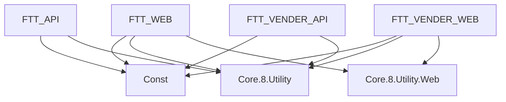

# 專案結構說明

## 解決方案架構 (FET.sln)

### 核心專案

#### 1. FTT_WEB
- **用途**: 門市報修管理前端介面
- **類型**: ASP.NET Core MVC Web Application
- **主要功能**:
  - 門市報修單管理
  - 審單作業
  - 派工流程
  - 完修確認

#### 2. FTT_API  
- **用途**: 門市報修管理 API 服務
- **類型**: ASP.NET Core Web API
- **主要功能**:
  - RESTful API 服務
  - 業務邏輯處理
  - 資料存取
  - 背景工作處理 (Hangfire)

#### 3. FTT_VENDER_WEB
- **用途**: 廠商報修管理前端介面  
- **類型**: ASP.NET Core MVC Web Application
- **主要功能**:
  - 廠商接案管理
  - 現場處理回報
  - 報價作業
  - 完修確認

#### 4. FTT_VENDER_API
- **用途**: 廠商報修管理 API 服務
- **類型**: ASP.NET Core Web API
- **主要功能**:
  - 廠商專用 API
  - 派工通知
  - 狀態回報
  - 檔案上傳

### 共用函式庫

#### 5. Const
- **用途**: 系統常數與資料傳輸物件
- **內容**:
  - `DbConst.cs`: 資料庫相關常數
  - `Enum.cs`: 系統列舉值
  - `DTO/`: 資料傳輸物件
  - `VO/`: 值物件
  - `RoleMenu/`: 權限選單模型

#### 6. Core.8.Utility
- **用途**: 核心工具函式庫
- **內容**:
  - `Common/`: 共用工具
  - `Config/`: 設定相關
  - `Extensions/`: 擴充方法
  - `Helper/`: 輔助類別

#### 7. Core.8.Utility.Web
- **用途**: Web 專用工具函式庫
- **內容**:
  - `Base/`: 基礎控制器
  - `HtmlHelperCustom/`: 自訂 HTML 輔助方法

## 資料夾結構

### 各專案共通結構
```
ProjectName/
├── Controllers/          # MVC 控制器
├── Models/              # 資料模型
├── Views/               # 視圖檔案 (僅 Web 專案)
├── wwwroot/             # 靜態資源
├── Properties/          # 專案屬性
├── Common/              # 專案共用代碼
├── bin/                 # 編譯輸出
├── obj/                 # 編譯暫存
├── appsettings.json     # 應用程式設定
├── Program.cs           # 程式進入點
└── *.csproj            # 專案檔
```

### 特殊資料夾說明

#### FTT_API & FTT_VENDER_API
- `Background/`: 背景工作服務
- `DataProtectionKeys/`: 資料保護金鑰
- `font/`: 字型檔案
- `MailTemplate/`: 郵件範本
- `PublicStaticFile/`: 公用靜態檔案

#### FTT_WEB & FTT_VENDER_WEB
- `ViewComponents/`: 視圖元件
- `logs/`: 系統日誌 (僅 FTT_WEB)

## 相依性關係



## 設定檔說明

### appsettings.json 主要設定項目
- **工作流程設定**: 狀態轉換設定
- **連線字串**: PostgreSQL 資料庫連線
- **JWT 設定**: 身分驗證設定
- **郵件 URL**: 系統通知連結
- **日誌設定**: 系統日誌層級
