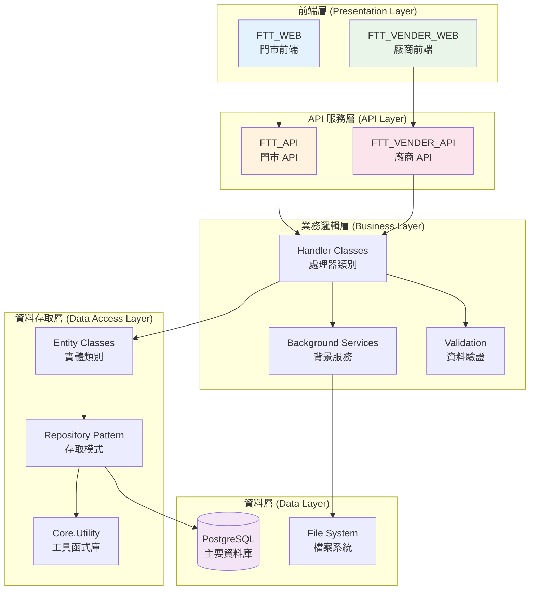
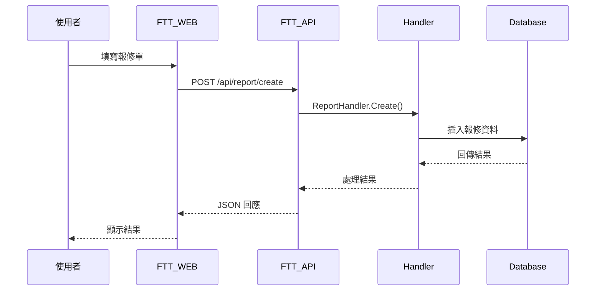
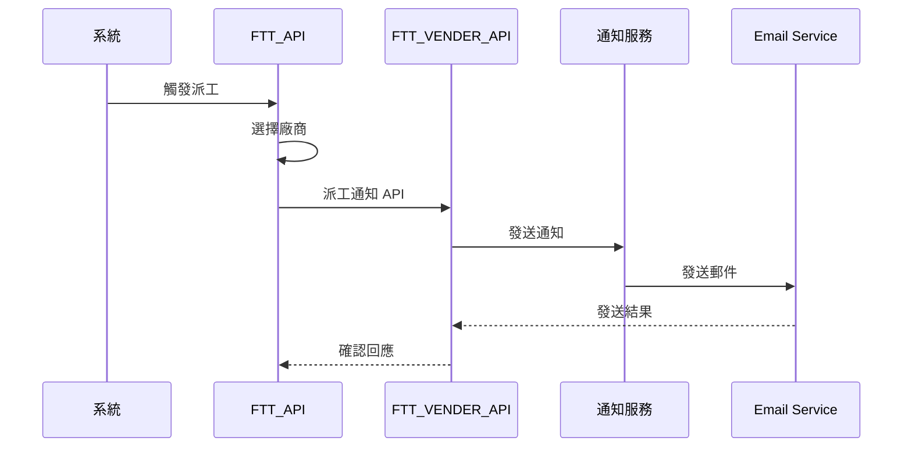

# 系統架構詳細說明

## 整體架構概覽

FTT 門市報修管理系統採用分層式架構設計，包含前端展示層、API 服務層、業務邏輯層、資料存取層和資料庫層。



## 技術棧詳細說明

### 前端技術
- **框架**: ASP.NET Core MVC
- **版本**: .NET 8.0
- **UI 框架**: Bootstrap 5
- **JavaScript 函式庫**:
  - jQuery 3.6+
  - jQuery Validation
  - Kendo UI (表格與控制項)
- **樣式**: CSS3 + SCSS

### 後端技術
- **API 框架**: ASP.NET Core Web API
- **ORM**: Entity Framework Core
- **驗證**: JWT Bearer Token
- **背景任務**: Hangfire
- **日誌**: Serilog
- **序列化**: Newtonsoft.Json

### 資料庫
- **主資料庫**: PostgreSQL 12+
- **連線池**: Npgsql Connection Pool
- **備份策略**: 自動備份每日執行
- **索引策略**: 複合索引優化查詢效能

### 基礎設施
- **部署**: Docker + Docker Compose
- **反向代理**: Nginx
- **監控**: Application Insights
- **快取**: MemoryCache + Redis (可選)

## 詳細模組架構

### 1. 門市系統 (FTT_WEB + FTT_API)

#### 控制器結構
```
Controllers/
├── HomeController.cs          # 首頁控制
├── BaseProjectController.cs   # 基底控制器
├── ApiController.cs           # API 端點
└── LogoutController.cs        # 登出處理
```

#### 模型結構
```
Models/
├── ViewModel/                 # 視圖模型
│   ├── HomeViewModel.cs
│   └── ReportViewModel.cs
├── Handler/                   # 業務處理器
│   ├── ReportHandler.cs
│   └── NotificationHandler.cs
└── Entity/                    # 資料實體
    └── DatabaseEntities.cs
```

### 2. 廠商系統 (FTT_VENDER_WEB + FTT_VENDER_API)

類似門市系統架構，但專注於廠商端的業務邏輯：
- 派工接收
- 現場回報
- 報價管理
- 完修確認

### 3. 共用元件

#### Const 專案結構
```
Const/
├── DbConst.cs                 # 資料庫常數
├── Enum.cs                    # 系統列舉
├── DTO/                       # 資料傳輸物件
│   ├── CIDataDTO.cs          # 維修項目 DTO
│   ├── StoreProfileDTO.cs     # 門市資料 DTO
│   └── DispatchProfileDTO.cs  # 派工資料 DTO
├── VO/                        # 值物件
│   ├── CommonVO.cs           # 共用值物件
│   └── CIConfigVO.cs         # 維修設定值物件
└── RoleMenu/                  # 角色權限
    ├── MenuModel.cs
    └── RoleFunc.cs
```

#### Core.8.Utility 工具庫
```
Core.8.Utility/
├── Common/                    # 共用工具
├── Config/                    # 設定管理
├── Extensions/                # 擴充方法
├── Helper/                    # 輔助類別
│   └── DB/                   # 資料庫輔助
└── Utility/                   # 通用工具
```

## 資料流程

### 1. 報修單建立流程


### 2. 派工流程


## 安全性架構

### 1. 認證機制
- **JWT Token**: 使用 RS256 演算法簽章
- **Token 有效期**: 30 分鐘 (可續約)
- **Refresh Token**: 7 天有效期
- **多重驗證**: 支援 TOTP

### 2. 授權控制
- **角色基礎**: RBAC (Role-Based Access Control)
- **細粒度權限**: 功能層級權限控制
- **API 保護**: 所有 API 端點都需要驗證

### 3. 資料保護
- **加密傳輸**: HTTPS/TLS 1.3
- **敏感資料**: AES-256 加密存儲
- **SQL 注入防護**: 參數化查詢
- **XSS 防護**: 輸入驗證與輸出編碼

## 效能優化

### 1. 資料庫優化
- **索引策略**: 複合索引覆蓋常用查詢
- **查詢優化**: 分頁查詢避免大數據集
- **連線池**: 最大 100 個並發連線
- **讀寫分離**: 查詢使用唯讀副本

### 2. 快取策略
- **應用層快取**: MemoryCache 15 分鐘
- **分散式快取**: Redis (可選)
- **HTTP 快取**: 靜態資源 CDN 快取
- **查詢結果快取**: 常用查詢結果快取

### 3. 非同步處理
- **背景任務**: Hangfire 處理長時間作業
- **訊息佇列**: 非即時處理任務
- **批次處理**: 大量資料匯入/匯出

## 部署架構

### 1. 容器化部署
```yaml
version: '3.8'
services:
  ftt-web:
    image: ftt-web:latest
    ports:
      - "80:80"
    depends_on:
      - ftt-api
      
  ftt-api:
    image: ftt-api:latest
    ports:
      - "5001:80"
    depends_on:
      - postgres
      
  postgres:
    image: postgres:13
    environment:
      POSTGRES_DB: infwf
      POSTGRES_USER: ftt
```

### 2. 負載均衡
- **Web 前端**: Nginx 負載均衡
- **API 服務**: Round-robin 分配
- **資料庫**: 主從複製架構

### 3. 監控與日誌
- **應用監控**: Application Insights
- **系統監控**: Prometheus + Grafana
- **日誌聚合**: ELK Stack
- **告警機制**: 關鍵指標異常告警

## 災難復原

### 1. 備份策略
- **資料庫備份**: 每日全備份 + 增量備份
- **應用程式**: Docker 映像版本管理
- **設定檔**: Git 版本控制

### 2. 復原計畫
- **RTO**: 復原時間目標 < 4 小時
- **RPO**: 復原點目標 < 1 小時
- **故障轉移**: 自動切換至備援系統
