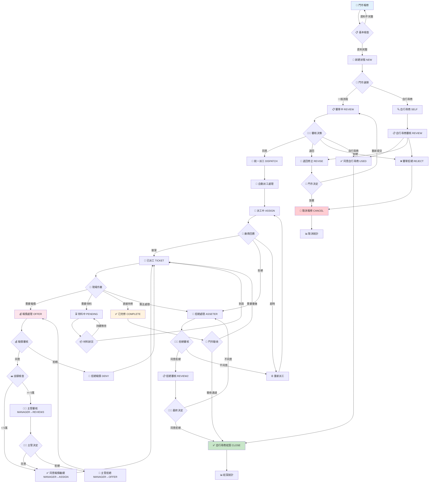

# 報修流程完整指南

## 📋 目錄
- [流程概述](#流程概述)
- [角色與職責](#角色與職責)
- [完整流程圖](#完整流程圖)
- [詳細流程步驟](#詳細流程步驟)
- [狀態轉換說明](#狀態轉換說明)
- [時效管理](#時效管理)
- [特殊情況處理](#特殊情況處理)
- [系統操作說明](#系統操作說明)
- [流程優化建議](#流程優化建議)

---

## 流程概述

FTT 門市報修管理系統的報修流程是一個完整的工作流程管理機制，從門市報修申請開始，經過審核、派工、維修、報價、完工到最終結案的完整生命週期。

### 流程特色
- 🔄 **全程數位化**: 所有流程步驟都在系統中進行
- 📱 **行動化支援**: 廠商可使用手機進行現場作業
- ⏰ **即時通知**: 關鍵節點自動發送通知
- 📊 **全程追蹤**: 可隨時查詢案件處理狀態
- 🔒 **權限控管**: 不同角色有不同的操作權限

### 流程效益
- ⚡ 提升處理效率
- 📈 降低溝通成本  
- 🎯 提高服務品質
- 📊 便於績效管理
- 💰 控制維修成本

---

## 角色與職責

### 1. 🏪 門市人員
```
主要職責:
✅ 建立報修單
✅ 提供故障資訊
✅ 確認報價內容
✅ 驗收完修結果
✅ 評價廠商服務

系統權限:
- 新增/修改報修單
- 查看報修進度
- 確認報價
- 完修驗收
- 廠商評價
```

### 2. 👨‍💼 審核人員
```
主要職責:
✅ 審核報修申請
✅ 評估維修必要性
✅ 決定處理方式
✅ 退回修正要求

系統權限:
- 審核報修單
- 同意/拒絕申請
- 退回修正
- 指定處理方式
```

### 3. 🎯 派工人員
```
主要職責:
✅ 執行派工作業
✅ 廠商選擇配對
✅ 監控派工狀態
✅ 處理廠商回應

系統權限:
- 自動派工執行
- 手動廠商選擇
- 重新派工
- 派工監控
```

### 4. 🔨 維修廠商
```
主要職責:
✅ 接受/拒絕派工
✅ 現場勘查維修
✅ 提供維修報價
✅ 執行維修作業
✅ 回報完修狀態

系統權限:
- 派工回應
- 現場簽到
- 進度回報
- 線上報價
- 完修通知
```

### 5. 💰 主管人員
```
主要職責:
✅ 高額報價審核
✅ 爭議案件處理
✅ 績效監控管理
✅ 政策決策制定

系統權限:
- 報價審核
- 案件處理
- 統計查詢
- 系統設定
```

---

## 完整流程圖



---

## 詳細流程步驟

### 階段一：報修申請 🏪

#### 1.1 門市建立報修單
```
📝 必填資訊:
├── 🏪 門市基本資料
│   ├── 門市代碼 (自動帶入)
│   ├── 門市名稱 (自動顯示)
│   ├── 聯絡人姓名 ⭐
│   └── 聯絡電話 ⭐
├── 🔧 報修資訊
│   ├── 報修類型 (下拉選擇) ⭐
│   ├── 緊急程度 (一般/緊急/非常緊急) ⭐
│   ├── 故障描述 (詳細說明) ⭐
│   └── 希望完成日期 ⭐
├── 🛠️ 維修項目
│   ├── 維修項目選擇 ⭐
│   ├── 數量規格
│   └── 補充說明
└── 📎 相關附件
    ├── 現場照片 (建議)
    └── 相關文件
```

#### 1.2 系統自動處理
- 🔢 自動產生報修單號
- 📅 記錄申請時間
- 👤 記錄申請人員
- 🏷️ 設定初始狀態為 **NEW**

#### 1.3 門市選擇處理方式
```
🤔 處理方式選擇:
├── 📋 一般審核流程
│   └── 狀態: NEW → REVIEW
└── 🔍 申請自行尋商
    └── 狀態: NEW → SELF
```

### 階段二：審核作業 👨‍💼

#### 2.1 審核人員檢視
```
🔍 審核檢查項目:
├── ✅ 報修資訊完整性
├── ✅ 維修必要性評估
├── ✅ 預算合理性檢查
├── ✅ 緊急程度確認
└── ✅ 歷史維修記錄
```

#### 2.2 審核決策選項
```
👨‍💼 審核結果:
├── ✅ 同意審核 (REVIEW → DISPATCH)
│   └── 進入統一派工流程
├── 📝 退回修正 (REVIEW → REVISE)
│   ├── 必須說明修正項目
│   └── 門市收到修正通知
├── ❌ 審核拒絕 (REVIEW → REJECT)
│   ├── 必須說明拒絕理由
│   └── 案件終止
└── 🔍 同意自行尋商 (REVIEW → USED)
    └── 門市自行找廠商處理
```

#### 2.3 退回修正處理
```
📝 修正流程:
├── 🏪 門市收到退回通知
├── 🔧 門市進行資料修正
└── 🤔 門市決定後續動作:
    ├── 重新送審 (REVISE → REVIEW)
    └── 放棄報修 (REVISE → CANCEL)
```

### 階段三：派工作業 🎯

#### 3.1 系統自動派工
```
🔄 自動派工邏輯:
├── 📍 地理位置匹配
│   └── 優先選擇服務區域內的廠商
├── 🔧 技能專業匹配
│   └── 根據維修項目選擇專業廠商
├── ⭐ 廠商評等排序
│   └── 優先選擇評等較高的廠商
├── 💼 工作負荷評估
│   └── 避免過度集中派工
└── 📊 歷史合作記錄
    └── 參考過往合作狀況
```

#### 3.2 廠商通知機制
```
📬 通知方式:
├── 🔔 系統內通知 (即時)
├── 📧 Email 通知 (5分鐘內)
├── 📱 簡訊通知 (緊急案件)
└── 📞 電話通知 (非常緊急)

⏰ 回應時間要求:
├── 非常緊急: 30 分鐘內回應
├── 緊急: 2 小時內回應
└── 一般: 4 小時內回應
```

#### 3.3 廠商回應處理
```
🔨 廠商回應選項:
├── ✅ 接受派工 (ASSIGN → TICKET)
│   ├── 填寫預計到場時間
│   ├── 填寫預計完成時間
│   └── 可填寫接案備註
├── ❌ 拒絕派工 (ASSIGN → ASSETER)
│   ├── 必須選擇拒絕理由
│   ├── 詳細說明拒絕原因
│   └── 影響廠商評等
└── ⏰ 超時未回應
    └── 系統自動重新派工
```

### 階段四：現場維修 🔧

#### 4.1 廠商現場作業
```
🏗️ 現場作業流程:
├── 📍 到場簽到 (GPS定位)
│   ├── 記錄到場時間
│   ├── 上傳現場照片
│   └── 初步狀況回報
├── 🔍 現場勘查診斷
│   ├── 確認故障原因
│   ├── 評估維修難度
│   └── 預估所需時間
├── 📋 狀況回報更新
│   ├── 實際故障情況
│   ├── 維修方案建議
│   └── 所需材料清單
└── 🔧 執行維修作業
    ├── 定期進度更新
    ├── 問題即時回報
    └── 完工狀態通知
```

#### 4.2 特殊狀況處理
```
⚠️ 特殊情況應對:
├── 🏪 現場無人
│   └── 聯絡門市重新安排時間
├── 🔍 故障描述不符
│   └── 即時回報實際狀況
├── 📦 需要特殊材料
│   └── 申請待料 (TICKET → PENDING)
├── 💰 需要額外費用
│   └── 提出報價申請 (TICKET → OFFER)
└── 🚫 超出維修能力
    └── 申請拒絕處理 (TICKET → ASSETER)
```

### 階段五：報價審核 💰

#### 5.1 廠商報價作業
```
💰 報價內容包含:
├── 🔧 人工費用明細
│   ├── 檢查診斷費
│   ├── 維修工時費
│   └── 其他服務費
├── 🛠️ 材料費用清單
│   ├── 零件更換費
│   ├── 耗材使用費
│   └── 材料運輸費
├── 💼 其他必要費用
│   ├── 高空作業費
│   ├── 緊急處理費
│   └── 特殊工具費
└── 📝 報價說明文件
    ├── 維修範圍說明
    ├── 材料規格明細
    ├── 保固期間說明
    └── 付款條件說明
```

#### 5.2 門市報價審核
```
🏪 門市審核流程:
├── 💰 費用合理性評估
├── 🔧 維修內容確認
├── 📋 材料規格檢查
└── 🤔 審核決定:
    ├── ✅ 同意報價 (OFFER → AGREE)
    └── ❌ 拒絕報價 (OFFER → DENY)
        ├── 說明拒絕理由
        ├── 可要求重新報價
        └── 可選擇重新派工
```

#### 5.3 主管審核機制
```
👨‍💼 主管審核條件:
├── 💵 金額 >= 5萬元
├── 🚨 特殊爭議案件
└── 📊 預算超支項目

👨‍💼 主管審核選項:
├── ✅ 同意報價 (MANAGER → ASSIGN)
│   └── 返回施工階段
├── ❌ 拒絕報價 (MANAGER → OFFER)
│   └── 要求重新報價
└── 🔄 退回重新評估
    └── 要求更詳細說明
```

### 階段六：完修驗收 ✅

#### 6.1 廠商完修回報
```
✅ 完修回報內容:
├── ⏰ 實際完成時間
├── 📋 維修內容摘要
│   ├── 故障原因說明
│   ├── 維修方法描述
│   └── 更換零件清單
├── 📷 完工照片上傳
│   ├── 維修前後對比
│   ├── 重要維修步驟
│   └── 最終完成狀態
├── 🧪 測試結果說明
│   ├── 功能測試結果
│   ├── 性能測試數據
│   └── 安全檢查確認
└── 📝 注意事項說明
    ├── 使用注意事項
    ├── 保養建議
    └── 保固說明
```

#### 6.2 門市驗收作業
```
🏪 門市驗收流程:
├── 🔍 現場功能確認
│   ├── 設備運轉測試
│   ├── 功能完整性檢查
│   └── 性能指標驗證
├── 📋 維修內容核對
│   ├── 對照原報修項目
│   ├── 確認維修完整性
│   └── 檢查額外問題
├── 🧹 現場整潔檢查
│   ├── 工具材料收拾
│   ├── 環境清潔狀況
│   └── 垃圾清理完成
└── 🤔 驗收決定:
    ├── ✅ 驗收通過 (COMPLETE → CLOSE)
    └── ❌ 需要重做 (COMPLETE → TICKET)
        └── 說明需改善項目
```

### 階段七：結案評價 🏁

#### 7.1 案件結案處理
```
🏁 結案處理流程:
├── 📊 更新案件狀態為 CLOSE
├── ⏰ 記錄實際完成時間
├── 💰 確認最終費用金額
├── 📋 產生結案報告
└── 📈 更新相關統計數據
```

#### 7.2 廠商服務評價
```
⭐ 評價項目:
├── 🔧 技術專業能力 (1-5星)
│   ├── 故障診斷準確度
│   ├── 維修技術水準
│   └── 問題解決能力
├── ⏰ 服務效率 (1-5星)
│   ├── 回應速度
│   ├── 到場準時性
│   └── 完工及時性
├── 😊 服務態度 (1-5星)
│   ├── 溝通協調能力
│   ├── 客戶服務意識
│   └── 專業形象表現
├── 💰 費用合理性 (1-5星)
│   ├── 報價透明度
│   ├── 費用合理性
│   └── 性價比評估
└── 📝 具體評價內容
    ├── 服務優點描述
    ├── 改善建議
    └── 推薦程度
```

---

## 狀態轉換說明

### 主要狀態定義
```
📊 系統狀態清單:
├── 🆕 NEW (新建) - 剛建立的報修單
├── 📋 REVIEW (審單中) - 等待審核
├── 🔍 SELF (自行尋商) - 門市自行找廠商
├── 📝 REVISE (退回修正) - 需要修正資料
├── ❌ REJECT (審單拒絕) - 審核不通過
├── ✅ USED (同意自行尋商) - 審核同意自找廠商
├── 🎯 DISPATCH (統一派工) - 系統派工中
├── 👷 ASSIGN (派工中) - 等待廠商回應
├── 🔧 TICKET (已派工) - 廠商已接案
├── 🚫 ASSETER (拒絕處理) - 廠商拒絕
├── 📋 REVIEW2 (拒絕審核) - 審核廠商拒絕
├── 💰 OFFER (報價處理) - 廠商提出報價
├── ✅ AGREE (同意報價) - 門市同意報價
├── ❌ DENY (拒絕報價) - 門市拒絕報價
├── 👨‍💼 MANAGER (主管審核) - 主管審核中
├── 📋 REVIEW3 (高額審核) - 高額報價審核
├── ⏳ PENDING (待料中) - 等待材料
├── ✅ COMPLETE (已完修) - 廠商完工
├── 🏁 CLOSE (結案) - 案件結案
└── 🚫 CANCEL (取消) - 取消報修
```

### 狀態轉換矩陣
```
📈 允許的狀態轉換:
NEW → REVIEW, SELF
REVIEW → DISPATCH, REVISE, REJECT, USED
SELF → REVIEW
REVISE → REVIEW, CANCEL
REJECT → CANCEL
USED → CLOSE
DISPATCH → ASSIGN
ASSIGN → TICKET, ASSETER
TICKET → OFFER, PENDING, COMPLETE, ASSETER
ASSETER → ASSIGN, REVIEW2
REVIEW2 → CLOSE, ASSETER
OFFER → AGREE, DENY
AGREE → MANAGER, TICKET
DENY → TICKET
MANAGER → ASSIGN, REVIEW3, OFFER
REVIEW3 → MANAGER
PENDING → TICKET
COMPLETE → CLOSE, TICKET
CLOSE → [終態]
CANCEL → [終態]
```

---

## 時效管理

### 關鍵節點時效要求

#### 1. 🔔 通知回應時效
```
⏰ 廠商回應時限:
├── 🚨 非常緊急: 30 分鐘
├── ⚡ 緊急: 2 小時  
└── 📋 一般: 4 小時

⏰ 門市回應時限:
├── 💰 報價回應: 1 工作日
├── ✅ 完修確認: 2 工作日
└── 📝 修正回應: 3 工作日

⏰ 審核回應時限:
├── 📋 一般審核: 1 工作日
├── 👨‍💼 主管審核: 2 工作日
└── 🚫 拒絕審核: 4 小時
```

#### 2. 📊 作業完成時效
```
⏰ 完工時間目標:
├── 🚨 非常緊急: 當日完成
├── ⚡ 緊急: 3 工作日內
└── 📋 一般: 7 工作日內

⏰ 階段時效控制:
├── 審核階段: 1 工作日
├── 派工階段: 4 小時
├── 現場到達: 24 小時
└── 報價提出: 現場確認後 1 工作日
```

### 超時處理機制

#### 1. 🚨 自動升級機制
```
⚠️ 超時自動處理:
├── 廠商回應超時 → 自動重新派工
├── 門市確認超時 → 發送催辦通知
├── 審核超時 → 自動升級主管處理
└── 完工超時 → 發送提醒並記錄延遲
```

#### 2. 📈 績效影響
```
📊 超時對績效的影響:
├── 廠商接案超時 → 降低派工優先權
├── 完工時間超時 → 影響廠商評等
├── 門市回應超時 → 發送主管通知
└── 審核超時 → 記錄處理效率
```

---

## 特殊情況處理

### 1. 🚨 緊急報修處理
```
🚨 緊急報修特殊流程:
├── 📞 可電話先行通報
├── 📝 優先審核處理 (30分鐘內)
├── 🎯 優先派工 (立即)
├── 📱 多管道通知廠商
├── ⏰ 縮短各階段時限
└── 👨‍💼 主管直接關注
```

### 2. 🔄 廠商拒絕處理
```
🚫 廠商拒絕後續處理:
├── 📊 記錄拒絕原因
├── 🔄 自動重新派工
├── 📈 影響廠商評等
├── 👀 人工介入檢視 (連續拒絕3次以上)
└── 📋 必要時暫停合作
```

### 3. 💰 報價爭議處理
```
💰 報價爭議處理流程:
├── 📞 電話溝通協調
├── 👨‍💼 主管介入調解
├── 📊 參考市場行情
├── 🤝 協商折衷方案
└── 📝 記錄處理結果
```

### 4. ⏰ 材料待料管理
```
📦 待料狀況管理:
├── 📅 預估到貨時間
├── 🔔 定期狀態更新
├── 📞 供應商協調
├── 🔄 必要時更換材料方案
└── 💰 材料費用確認
```

### 5. ❌ 完修驗收不通過
```
❌ 驗收不通過處理:
├── 📝 明確指出問題點
├── ⏰ 設定重做期限
├── 🔄 重新執行維修
├── 👨‍💼 必要時主管介入
└── 💰 費用爭議處理
```

---

## 系統操作說明

### 1. 🏪 門市操作要點
```
📝 建立報修單技巧:
├── 詳細描述故障現象
├── 上傳清晰現場照片
├── 正確選擇維修項目
├── 標示適當緊急程度
└── 填寫完整聯絡資訊

🔍 查詢追蹤技巧:
├── 使用報修單號快速查詢
├── 定期檢查待辦事項
├── 關注系統通知訊息
└── 及時回應各項確認
```

### 2. 🔨 廠商操作要點
```
📱 行動操作技巧:
├── 及時回應派工通知
├── 使用GPS現場簽到
├── 即時上傳進度照片
├── 詳實填寫作業記錄
└── 完整提供報價明細

⏰ 時效管理技巧:
├── 合理評估作業時間
├── 提前通知可能延遲
├── 主動更新作業進度
└── 準時完成各階段工作
```

### 3. 👨‍💼 管理操作要點
```
📊 管理監控技巧:
├── 定期檢視待審案件
├── 關注超時預警通知
├── 分析廠商績效數據
├── 監控整體作業效率
└── 及時處理異常狀況

📈 績效分析技巧:
├── 定期產生統計報表
├── 分析流程瓶頸點
├── 評估廠商服務品質
└── 持續優化作業流程
```

---

## 流程優化建議

### 1. 📈 效率提升建議
```
⚡ 提升處理效率:
├── 🤖 增加自動化程度
│   ├── 智能派工算法優化
│   ├── 自動催辦通知機制
│   └── 異常狀況自動升級
├── 📱 強化行動化支援
│   ├── 行動版介面優化
│   ├── 離線操作支援
│   └── 推播通知優化
└── 🔄 簡化作業流程
    ├── 減少不必要步驟
    ├── 合併重複作業
    └── 優化表單設計
```

### 2. 🎯 品質提升建議
```
📊 提升服務品質:
├── 🎓 強化教育訓練
│   ├── 系統操作培訓
│   ├── 服務標準建立
│   └── 最佳實務分享
├── 📋 建立品質標準
│   ├── 服務水準協議 (SLA)
│   ├── 品質檢核機制
│   └── 客戶滿意度調查
└── 💰 優化成本控制
    ├── 預算管理機制
    ├── 費用審核標準
    └── 成本效益分析
```

### 3. 🔧 技術改進建議
```
💻 技術優化方向:
├── 🤖 AI 技術應用
│   ├── 智能故障診斷
│   ├── 預測性維護
│   └── 廠商智能匹配
├── 📊 大數據分析
│   ├── 故障模式分析
│   ├── 維修趨勢預測
│   └── 成本優化建議
└── 🌐 整合性提升
    ├── 其他系統整合
    ├── 數據同步優化
    └── 介面標準化
```

### 4. 📋 管理改進建議
```
🎯 管理機制優化:
├── 📈 KPI 指標建立
│   ├── 處理時效指標
│   ├── 服務品質指標
│   └── 客戶滿意指標
├── 🏆 激勵機制設計
│   ├── 績效獎勵制度
│   ├── 服務品質競賽
│   └── 持續改善建議
└── 📚 知識管理建立
    ├── 常見問題知識庫
    ├── 最佳實務案例
    └── 經驗分享平台
```

---

## 📊 流程效益評估

### 數位化效益
- ⚡ **效率提升 40%**: 相比傳統紙本作業
- 📞 **溝通成本降低 60%**: 減少電話往返確認
- 📊 **透明度提升 100%**: 全程可視化追蹤
- 💰 **管理成本節省 30%**: 自動化處理流程

### 服務品質提升
- ⭐ **客戶滿意度 >90%**: 根據使用者回饋
- 📈 **完工準時率 >95%**: 時效管理機制
- 🎯 **一次完修率 >85%**: 改善維修品質
- 🔄 **問題回溯率 <5%**: 品質控制機制

---

*本文件版本: v1.0 | 最後更新: 2026年1月12日*
