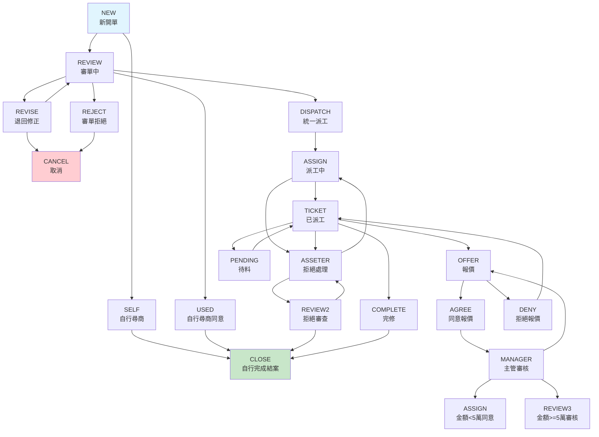

# 業務流程與狀態管理

## 報修流程概述

FTT 系統的核心是報修單的狀態流轉管理，從門市報修到廠商完修的完整生命週期。

## 主要流程狀態

### 狀態定義
根據系統設定，報修單有以下主要狀態：

| 狀態代碼 | 中文說明 | 英文說明 | 角色 |
|---------|---------|----------|------|
| NEW | 新開單 | New Request | 門市 |
| SELF | 自行尋商 | Self Sourcing | 門市 |
| REVIEW | 審單中 | Under Review | 審核人員 |
| REVISE | 退回修正 | Revision Required | 門市 |
| REJECT | 審單拒絕 | Rejected | 審核人員 |
| DISPATCH | 統一派工 | Dispatched | 系統 |
| ASSIGN | 派工中 | Assignment | 派工人員 |
| TICKET | 已派工 | Ticketed | 廠商 |
| OFFER | 報價處理 | Price Quotation | 廠商/門市 |
| PENDING | 待料中 | Material Pending | 廠商 |
| COMPLETE | 已完修 | Completed | 廠商 |
| CLOSE | 結案 | Closed | 門市 |
| CANCEL | 取消 | Cancelled | 門市 |

## 完整流程圖

## 狀態轉換規則

### 1. 新建流程 (NEW → REVIEW/SELF)
- **NEW,REVIEW**: 一般報修單審核流程
- **SELF,REVIEW**: 門市自行尋商後提交審核

### 2. 審核階段 (REVIEW → multiple)
- **REVIEW,USED**: 同意自行尋商
- **REVIEW,REVISE**: 退回修正
- **REVIEW,REJECT**: 審單拒絕
- **REVIEW,DISPATCH**: 統一派工

### 3. 修正與取消
- **REVISE,REVIEW**: 修正後重新審核
- **REVISE,CANCEL**: 放棄修正，直接取消
- **REJECT,CANCEL**: 拒絕後取消

### 4. 自行尋商結案
- **USED,CLOSE**: 自行尋商完成

### 5. 派工流程 (DISPATCH → ASSIGN → TICKET)
- **DISPATCH,ASSIGN**: 自動派工
- **ASSIGN,ASSETER**: 廠商拒絕接案
- **ASSIGN,TICKET**: 廠商接案開始處理

### 6. 拒絕處理流程
- **ASSETER,ASSIGN**: 不同意拒絕，重新派工
- **ASSETER,REVIEW2**: 同意拒絕，進入審查
- **REVIEW2,CLOSE**: 同意拒絕結案
- **REVIEW2,ASSETER**: 不同意拒絕處理

### 7. 現場處理階段
- **TICKET,OFFER**: 需要報價
- **TICKET,PENDING**: 等待材料
- **TICKET,COMPLETE**: 現場完修
- **TICKET,ASSETER**: 現場拒絕處理

### 8. 報價流程
- **OFFER,AGREE**: 同意報價
- **OFFER,DENY**: 拒絕報價
- **DENY,TICKET**: 重新派工處理

### 9. 主管審核 (金額控制)
- **MANAGER,ASSIGN**: 金額 < 5萬，同意報價
- **MANAGER,REVIEW3**: 金額 >= 5萬，需更高層級審核
- **MANAGER,OFFER**: 不同意報價

### 10. 材料管理
- **PENDING,TICKET**: 材料到貨，恢復施工

### 11. 完修結案
- **COMPLETE,CLOSE**: 完修確認結案

## 角色權限

### 門市人員
- 新建報修單
- 修正退回的報修單
- 確認報價
- 確認完修結案

### 審核人員
- 審核報修單
- 退回修正
- 拒絕報修
- 決定派工方式

### 派工人員
- 指派廠商
- 處理廠商拒絕
- 監控派工狀態

### 廠商
- 接受/拒絕派工
- 現場處理回報
- 提交報價
- 申請待料
- 完修回報

### 主管
- 審核高金額報價
- 處理爭議案件
- 系統監控

## 郵件通知機制

系統在關鍵狀態轉換時會發送通知郵件：

- **門市系統 URL**: `MailURL` 設定
- **廠商系統 URL**: `MailURL_VENDOR` 設定
- **URL 有效期**: `LastURLValidityperiod` 設定 (2小時)

## 系統整合要點

1. **狀態一致性**: 所有狀態轉換必須通過 API 進行
2. **權限控制**: 不同角色只能執行特定的狀態轉換
3. **審計追蹤**: 所有狀態變更需要記錄時間和操作人員
4. **通知機制**: 關鍵節點需要即時通知相關人員
5. **異常處理**: 系統異常時的回復機制
