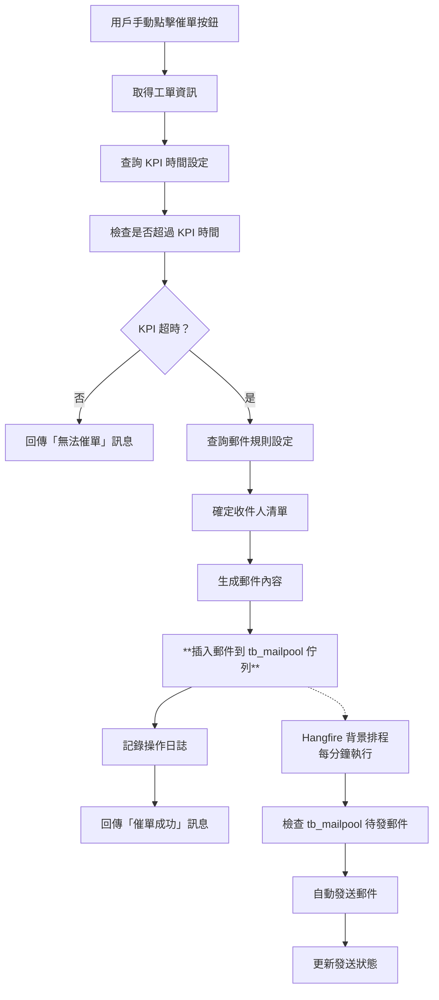

# 📋 FTT 系統催單通知機制說明文檔
### 🔄 **雙重機制說明**
1. **催單決策**：手動觸發（避免不必要的催單騷擾）
2. **郵件發送**：自動執行（確保可靠且有序的郵件傳送）

### ⚠️ **已知限制**
**重要：目前版本沒有防重複催單機制！**
- 🚨 **一天內可多次催單**：同一工單可以在一天內被多次催單（每次KPI超時檢查通過即可）
- 📝 **無歷史檢查**：每次催單都會記錄到 `FTT_FORM_LOG`，但不會檢查歷史催單記錄
- ⏱️ **無時間間隔限制**：沒有最小催單間隔時間設定
- � **重複郵件風險**：承辦人員可能在短時間內收到多封重複催單郵件
- �💡 **改善建議**：建議實作防重複邏輯（如：同一天內最多催單一次，或設定最小間隔時間）

### 📊 **與舊版本差異**
**經過實際程式碼分析發現：**

#### 🔍 舊版本機制分析 (AP\FTTTask\ReNotify.cs)
舊版本確實有「每日限制一次」的催單行為，但實現方式與新版本完全不同：

**1. 執行方式差異**：
- **舊版本**：使用 FTTTask 排程程式批次處理
- **新版本**：使用 Web API 即時處理

**2. 觸發機制**：
```csharp
// 舊版本：系統排程自動觸發所有超過 KPI 的工單
// Program.cs case "5": mReNotify.Send_RE_Notify();

// 新版本：使用者手動點擊個別工單的催單按鈕
// InProcessController.InsterTrackingForm(v_ftt_form2DTO vm)
```

**3. 防重複機制**：
- **舊版本**：依靠排程執行頻率控制（可能每日執行一次）
- **新版本**：無任何防重複控制

**4. 郵件佇列**：
- **舊版本**：使用 `notify_profile_new` 表格
- **新版本**：使用 `tb_mailpool` 表格

#### 💡 為何舊版本每天只寄一次？
1. **排程控制**：系統管理員可能設定 FTTTask 每日只執行一次
2. **批次處理**：一次處理所有符合條件的工單，避免重複觸發
3. **表格設計**：`notify_profile_new` 可能有日期相關的約束機制

#### 🔄 新版本改善建議
基於舊版本分析，建議實作以下邏輯：
```csharp
// 模擬舊版本的日期檢查機制
internal bool HasReminderToday(string formNo)
{
    string sql = @"
        SELECT COUNT(*) 
        FROM FTT_FORM_LOG 
        WHERE FORM_NO = @formNo 
        AND FIELDNAME = '催單' 
        AND TRUNC(UPDATETIME) = TRUNC(SYSDATE)";
    
    return GetDBHelper().FindSingle<int>(sql, paras) > 0;
}
```

---📖 目錄
- [概述](#概述)
- [觸發條件](#觸發條件)
- [運作流程](#運作流程)
- [技術實作](#技術實作)
- [資料庫設計](#資料庫設計)
- [設定參數](#設定參數)
- [使用說明](#使用說明)
- [故障排除](#故障排除)

---

## ⚠️ 重要說明

**FTT 催單通知機制採用混合模式執行！**

- 🖱️ **手動觸發催單**：使用者點擊催單按鈕觸發催單檢查
- 🤖 **自動發送郵件**：Hangfire 背景服務每分鐘自動檢查並發送待發郵件
- 📬 **郵件佇列機制**：催單請求先寫入 `tb_mailpool`，再由排程自動發送
- ⏰ **即時檢查 + 延遲發送**：即時檢查 KPI 狀態，延遲發送以避免瞬間大量郵件

### � **雙重機制說明**
1. **催單決策**：手動觸發（避免不必要的催單騷擾）
2. **郵件發送**：自動執行（確保可靠且有序的郵件傳送）

---

## 🎯 概述

FTT 系統的催單通知機制是一個智能化的工單追蹤提醒系統，採用 **混合執行模式**：催單決策需要手動觸發，但郵件發送由系統自動處理。當工單超過預設的處理時間時，使用者可以點擊催單按鈕，系統會將催單通知加入郵件佇列，再由背景排程自動發送給相關負責人員。

### 執行方式
- 🖱️ **手動催單決策**：需要使用者主動點擊催單按鈕
- 🤖 **自動郵件發送**：Hangfire 排程每分鐘自動處理郵件佇列
- 📍 **條件限制**：只有超過 KPI 時間的工單才能催單
- 📬 **佇列機制**：透過 `tb_mailpool` 表格進行郵件佇列管理

### 核心特色
- ✅ **智能判斷**：基於 KPI 時間的自動檢查
- ✅ **權限控制**：根據角色權限發送通知
- ✅ **模板化郵件**：支援動態參數替換
- ✅ **完整日誌**：記錄所有催單操作
- ✅ **多重通知**：支援主要收件人與副本

---

## 🚦 觸發條件

### 1. KPI 時間超時檢查

催單功能會檢查以下條件：

```sql
-- 檢查工單是否超過 KPI 時間
SELECT * FROM APPROVE_FORM 
WHERE FORM_NO = @FORM_NO 
AND CHK_WORKING_DAY2(UPDATETIME, SYSDATE, 'S') > @kpiTime
```

### 2. KPI 時間設定來源

```sql
-- 從品項分類取得 KPI 時間設定
SELECT category.kpitime 
FROM FTT_FORM form, CI_RELATIONS_CATEGORY category 
WHERE category.CISID = form.CATEGORY_ID 
AND form.FORM_NO = @form_no
```

### 3. 預設值
- 如果品項分類未設定 KPI 時間，預設為 **3 天**
- KPI 計算排除週末和國定假日（工作日計算）

---

## 🔄 運作流程

### ⚠️ 催單發送頻率說明

**目前系統催單發送頻率：無限制（一天內可多次催單）**

#### 🕐 實際行為分析：
1. **觸發條件**：只要工單超過 KPI 時間，每次點擊催單按鈕都會執行
2. **發送頻率**：**一天內可多次發送**，沒有時間間隔限制
3. **記錄機制**：每次催單都會在 `FTT_FORM_LOG` 新增一筆記錄
4. **郵件佇列**：每次催單都會在 `tb_mailpool` 新增一筆待發郵件

#### 🔍 與舊版本比較：
如果您觀察到舊版本系統「每天只寄發一次催單」，可能的原因：
- **舊版本有日期檢查**：舊版本程式碼可能包含當日重複檢查邏輯
- **前端限制**：舊版本前端可能在催單後禁用按鈕24小時
- **資料庫約束**：舊版本資料庫可能有 UNIQUE 約束防止重複記錄
- **業務邏輯改變**：新版本移除了原有的防重複機制

#### 📈 催單頻率測試範例：
```sql
-- 查詢同一工單的催單記錄
SELECT 
    FORM_NO,
    UPDATE_EMPNO,
    UPDATETIME,
    COUNT(*) OVER (PARTITION BY FORM_NO, TRUNC(UPDATETIME)) as daily_count
FROM FTT_FORM_LOG 
WHERE FORM_NO = 12345 
AND FIELDNAME = '催單' 
ORDER BY UPDATETIME DESC;

-- 查詢當日催單次數
SELECT 
    FORM_NO,
    TRUNC(UPDATETIME) as reminder_date,
    COUNT(*) as daily_reminders
FROM FTT_FORM_LOG 
WHERE FORM_NO = 12345 
AND FIELDNAME = '催單' 
GROUP BY FORM_NO, TRUNC(UPDATETIME)
ORDER BY reminder_date DESC;
```

### 完整流程圖



### 步驟詳解

#### 步驟 1：觸發檢查
```csharp
// 位置：InProcessController.InsterTrackingForm()
var form_No = vm.form_no;
string kpiTime = _InProcessHanlder.GetKPITime(form_No);
if (kpiTime == "") kpiTime = "3";

bool overKPI = _InProcessHanlder.CheckDataExist_APPROVE_FORM(form_No, kpiTime);
```

#### 步驟 2：郵件規則查詢與佇列插入
```csharp
// 創建催單郵件並插入佇列
var result = Method.CreateMailPool(form_No, "", "REMINDER", _MailPoolHandler);

// CreateMailPool 方法會：
// 1. 查詢郵件規則
// 2. 生成郵件內容
// 3. 插入到 tb_mailpool 佇列等待發送
```

#### 步驟 3：背景自動發送（Hangfire 排程）
```csharp
// 在 Program.cs 中註冊的排程
RecurringJob.AddOrUpdate<SendMailHandler>(
    nameof(SendMailHandler.Send),
    (job) => job.Send(),
    "* * * * *",  // 每分鐘執行一次
    new RecurringJobOptions
    {
        TimeZone = TimeZoneInfo.FindSystemTimeZoneById("Taipei Standard Time")
    }
);

// SendMailHandler.Send() 會：
// 1. 查詢 tb_mailpool 中待發送的郵件
// 2. 透過 SMTP 發送郵件
// 3. 更新郵件發送狀態
```

#### 步驟 4：日誌記錄
```sql
INSERT INTO FTT_FORM_LOG 
(FORM_NO, UPDATE_EMPNO, UPDATETIME, FIELDNAME, ACTION, FORM_TYPE, ROOT_NO) 
VALUES (@formNo, @empName, SYSDATE, '催單', 'FORM', @formType, @formNo)
```

---

## 💻 技術實作

### 主要程式檔案

#### 1. 控制器層
**檔案**：`FTT_API/Controllers/InProcess/InProcessController.cs`
```csharp
[ValidateAntiForgeryToken]
[HttpPost("[action]")]
public IActionResult InsterTrackingForm(v_ftt_form2DTO vm)
{
    // 催單邏輯實作
    var form_No = vm.form_no;
    var _InProcessHanlder = new InProcessHandler(_config, HttpContext);
    
    // KPI 檢查
    string kpiTime = _InProcessHanlder.GetKPITime(form_No);
    bool overKPI = _InProcessHanlder.CheckDataExist_APPROVE_FORM(form_No, kpiTime);
    
    if (overKPI == true) {
        // 新增：檢查今天是否已催過單
        if (_InProcessHanlder.HasReminderToday(form_No))
        {
            return JsonValidFail($"此工單【{form_No}】今日已催過單，每工單每日限催單一次！");
        }
        
        // 發送催單通知
        MailPoolHandler _MailPoolHandler = new MailPoolHandler();
        var result = Method.CreateMailPool(form_No, "", "REMINDER", _MailPoolHandler);
        
        this.LogSuccess("已發送催單通知!!");
        return JsonSuccess("已發送催單通知!!");
    } else {
        return JsonValidFail($"此工單【{form_No}】KPI為{kpiTime}天，目前尚未Fail，無法催單!!");
    }
}
```

#### 2. 業務邏輯层
**檔案**：`FTT_API/Models/Handler/InProcessHandler.cs`
```csharp
// KPI 超時檢查
internal bool CheckDataExist_APPROVE_FORM(string form_no, string kpiTime)
{
    string tableName = " APPROVE_FORM ";
    string strWhere = " FORM_NO=@FORM_NO AND CHK_WORKING_DAY2(UPDATETIME,SYSDATE,'S') > @kpiTime ";
    return CheckDataExist(tableName, strWhere, paras);
}

// 取得 KPI 時間設定
internal string GetKPITime(string form_no)
{
    string sql = " select category.kpitime from FTT_FORM form, CI_RELATIONS_CATEGORY category where category.CISID=form.CATEGORY_ID AND form.FORM_NO=@form_no ";
    return GetDBHelper().FindScalar<string>(sql, paras);
}
```

#### 3. 郵件處理層
**檔案**：`FTT_API/Common/Method.cs`
```csharp
public static string CreateMailPool(string form_no, string oldStatus, string newStatus, MailPoolHandler _MailPoolHandlerHandler)
{
    // 查詢郵件規則
    var list = _MailPoolHandlerHandler.FindMailPoolRuleList(oldStatus + "," + newStatus);
    
    foreach (var item in list) {
        // 確定收件人
        var _AccessRole = _MailPoolHandlerHandler.FindAccessRole(form_no, item.mail_reciver);
        mail_reciver = GetReciverMail(_MailPoolHandlerHandler, _AccessRole, item.mail_reciver, out reviverName);
        
        // 生成郵件內容
        var subject = item.mailsubject
            .Replace("([FORM_NO])", form_no)
            .Replace("([STORE])", reviverName)
            .Replace("([VENDOR])", reviverName);
            
        var content = item.mailhead + item.mailcontent
            .Replace("([FORM_NO])", form_no)
            .Replace("([REVIVERNAME])", reviverName)
            .Replace("([EMPNAME])", fttForm.empname)
            .Replace("([CREATETIME])", createtime)
            .Replace("([CATEGORY_NAME])", fttForm.category_name);
    }
}
```

---

## 🗃️ 資料庫設計

### 核心資料表

#### 1. tb_mailpool_rule（郵件規則表）
```sql
CREATE TABLE tb_mailpool_rule (
    id               NUMBER PRIMARY KEY,           -- 自動流水號
    description      VARCHAR2(500),                -- 描述
    mail_type        VARCHAR2(50),                 -- 郵件類型（REMINDER）
    mail_reciver     VARCHAR2(100),                -- 收件人
    mail_reciver_cc  VARCHAR2(500),                -- 副本收件人
    mailsubject      VARCHAR2(200),                -- 郵件主旨
    mailhead         CLOB,                         -- 郵件開頭
    mailcontent      CLOB,                         -- 郵件內容模板
    status          NUMBER(1),                     -- 狀態
    creator         NUMBER,                        -- 建立者
    createtime      DATE,                          -- 建立時間
    updater         NUMBER,                        -- 更新者
    updatetime      DATE                           -- 更新時間
);
```

#### 2. access_role（權限角色表）
```sql
CREATE TABLE access_role (
    form_no         NUMBER,                        -- 工單號碼
    user_type       VARCHAR2(20),                  -- 用戶類型
    empno           VARCHAR2(20),                  -- 員工編號
    deptcode        VARCHAR2(20),                  -- 部門代碼
    -- 其他欄位...
);
```

#### 3. FTT_FORM_LOG（操作日誌表）
```sql
CREATE TABLE FTT_FORM_LOG (
    FORM_NO         NUMBER,                        -- 工單號碼
    UPDATE_EMPNO    VARCHAR2(50),                  -- 操作員工
    UPDATETIME      DATE,                          -- 操作時間
    FIELDNAME       VARCHAR2(50),                  -- 欄位名稱
    ACTION          VARCHAR2(20),                  -- 動作（催單）
    FORM_TYPE       VARCHAR2(20),                  -- 表單類型
    ROOT_NO         NUMBER                         -- 根工單號碼
);
```

#### 4. CI_RELATIONS_CATEGORY（品項分類表）
```sql
CREATE TABLE CI_RELATIONS_CATEGORY (
    CISID           NUMBER PRIMARY KEY,            -- 分類 ID
    kpitime         NUMBER,                        -- KPI 時間（天）
    -- 其他欄位...
);
```

#### 5. tb_mailpool（郵件佇列表）
```sql
CREATE TABLE tb_mailpool (
    id                      NUMBER PRIMARY KEY,           -- 自動流水號
    subject                 VARCHAR2(200),                -- 郵件主旨
    content                 CLOB,                         -- 郵件內容
    estimatesendtime        DATE,                         -- 預計發送時間
    realsendtime           DATE,                          -- 實際發送時間
    sendstatus             NUMBER(1),                     -- 發送狀態 (0=未發送, 1=已發送, 2=錯誤)
    errormsg               VARCHAR2(500),                 -- 錯誤訊息
    status                 NUMBER(1),                     -- 狀態
    creator                NUMBER,                        -- 建立者
    createtime             DATE,                          -- 建立時間
    updater                NUMBER,                        -- 更新者
    updatetime             DATE,                          -- 更新時間
    destinationemail       VARCHAR2(500),                 -- 收件人信箱
    destinationemail_cc    VARCHAR2(1000)                 -- 副本收件人信箱
);
```

### 重要檢視表

#### v_ftt_form2（工單檢視表）
```sql
-- 整合工單相關資訊的檢視表
CREATE VIEW v_ftt_form2 AS
SELECT 
    form_no,
    tt_category,
    l2_desc,
    ciname,
    createtime,
    shop_name,
    statusname,
    updatetime,
    StatusId,
    kpi_days,
    kpi_result
FROM FTT_FORM f
JOIN CI_RELATIONS_CATEGORY c ON f.CATEGORY_ID = c.CISID
-- 其他關聯表...
```

---

## ⚙️ 設定參數

### appsettings.json 設定

```json
{
  "MailURL": "https://localhost:50102/Query?FuncId=Query_View&className=門市報修管理&form_no=",
  "MailURL_VENDOR": "https://localhost:50402/Query?FuncId=Query_View&className=門市報修管理&form_no=",
  
  "MailContentCustom": "",
  "EnableSendMailSchedule": true,
  
  "HangFireScheduledTime": {
    "CheckVendorLastChangePW": "* * * * *",
    "CheckVendorLastLogin": "10 10 * * *",
    "DailyReminderCheck": "0 9 * * 1-5"     // 新增這行
  },
  
  "GmailConfig": {
    "MailUserID": "service@websoft.com.tw",
    "MailUserPwd": "qcgx hcwq mvwz xtnx",
    "SmtpServer": "smtp.gmail.com",
    "SmtpPort": "587",
    "EnableSsl": true
  }
}
```

### 重要設定說明
- **EnableSendMailSchedule**: 控制是否啟用郵件自動發送排程
- **HangFireScheduledTime**: 設定各種排程任務的執行時間
- **每分鐘執行**: `"* * * * *"` 表示每分鐘檢查一次郵件佇列

### 郵件範本參數

**支援的動態參數：**
- `([FORM_NO])`：工單號碼
- `([STORE])`：門市名稱
- `([VENDOR])`：廠商名稱
- `([REVIVERNAME])`：收件人姓名
- `([EMPNAME])`：建單員工姓名
- `([CREATETIME])`：建單時間
- `([CATEGORY_NAME])`：品項分類名稱
- `([MailURL])`：門市系統連結
- `([MailURL_VENDOR])`：廠商系統連結

---

## 👤 使用說明

### 管理員設定

#### 1. 設定 KPI 時間
```sql
-- 更新品項分類的 KPI 時間
UPDATE CI_RELATIONS_CATEGORY 
SET kpitime = 5 
WHERE CISID = 123;
```

#### 2. 設定郵件規則
```sql
-- 新增催單郵件規則
INSERT INTO tb_mailpool_rule (
    description, mail_type, mail_reciver, mail_reciver_cc,
    mailsubject, mailhead, mailcontent, status
) VALUES (
    '催單通知規則', 'REMINDER', 'VENDOR', 'MANAGER',
    '工單催單通知 - ([FORM_NO])',
    '<p>親愛的 ([REVIVERNAME]) 您好：</p>',
    '<p>工單 ([FORM_NO]) 已超過處理時間，請儘速處理。</p>',
    1
);
```

### 一般使用者操作（混合模式）

#### 重要提醒 ⚠️
**催單採用混合執行模式：催單決策需手動觸發，郵件發送由系統自動處理。**

#### 1. 查看可催單工單
- 進入「處理中工單」頁面
- 系統會顯示所有處理中的工單
- 超過 KPI 時間的工單旁邊會有「催單」按鈕可點擊
- 未超過 KPI 時間的工單催單按鈕會是停用狀態

#### 2. 執行催單操作
1. **手動點擊**工單旁的「催單」按鈕
2. 系統會即時檢查 KPI 狀態
3. 若符合條件（超過 KPI 時間），將催單郵件加入發送佇列
4. 若不符合條件，顯示錯誤訊息：「此工單 KPI 為 X 天，目前尚未 Fail，無法催單」

#### 3. 催單執行結果
- ✅ **成功**：顯示「已發送催單通知!!」（實際上是加入佇列）
- ❌ **失敗**：顯示具體錯誤原因
- 📝 **記錄**：所有操作都會記錄到系統日誌中
- 🤖 **自動發送**：Hangfire 排程會在 1 分鐘內自動發送郵件

#### 4. 查看催單記錄
```sql
-- 查詢催單操作記錄
SELECT * FROM FTT_FORM_LOG 
WHERE ACTION = '催單' 
AND FORM_NO = 12345
ORDER BY UPDATETIME DESC;

-- 查詢郵件佇列狀態
SELECT * FROM tb_mailpool 
WHERE subject LIKE '%催單%' 
ORDER BY createtime DESC;
```

---

## 🛠️ 故障排除

### 常見問題

#### 問題 1：催單按鈕無法點擊
**原因**：工單未超過 KPI 時間
**解決方法**：
```sql
-- 檢查 KPI 狀態
SELECT 
    form_no,
    kpitime,
    CHK_WORKING_DAY2(UPDATETIME, SYSDATE, 'S') as days_passed
FROM v_ftt_form2 
WHERE form_no = 12345;
```

#### 問題 2：催單郵件未發送
**原因**：郵件規則設定錯誤
**解決方法**：
```sql
-- 檢查郵件規則
SELECT * FROM tb_mailpool_rule 
WHERE mail_type = 'REMINDER' 
AND status = 1;
```

#### 問題 3：收件人不正確
**原因**：權限角色設定錯誤
**解決方法**：
```sql
-- 檢查權限設定
SELECT * FROM access_role 
WHERE form_no = 12345;
```

#### 問題 4：郵件發送延遲
**原因**：Hangfire 排程延遲或 `EnableSendMailSchedule` 設定為 false
**解決方法**：
```sql
-- 檢查佇列中的郵件
SELECT 
    subject,
    estimatesendtime,
    sendstatus,
    errormsg
FROM tb_mailpool 
WHERE sendstatus = 0  -- 未發送
ORDER BY estimatesendtime;
```

```json
// 檢查 appsettings.json 設定
{
  "EnableSendMailSchedule": true  // 必須為 true
}
```

### 日誌查看

#### 應用程式日誌
```csharp
// 查看控制台輸出
Console.WriteLine("[催單] 工單：12345，KPI：3天，狀態：超時");
```

#### 資料庫日誌
```sql
-- 查看催單操作記錄
SELECT 
    FORM_NO,
    UPDATE_EMPNO,
    UPDATETIME,
    ACTION
FROM FTT_FORM_LOG 
WHERE ACTION = '催單'
ORDER BY UPDATETIME DESC;
```

---

## 📞 技術支援

### 開發團隊聯絡資訊
- **系統負責人**：FTT 開發團隊
- **技術文檔**：`/Documents/Development/Developer-Guide.md`
- **API 文檔**：`/Documents/API-Documentation/FTT-API.md`

### 相關文檔
- [郵件告警機制指南](./Alert-Notification-Guide.md)
- [工單流程說明](../Business-Process/Form-Workflow-Guide.md)
- [權限管理說明](../Security/Role-Permission-Guide.md)

---

**最後更新：2026年3月9日**  
**文檔版本：v1.0**  
**維護人員：FTT 系統開發團隊**

---

## 🚨 重要發現：防重複催單機制缺失

### 現況分析
經過程式碼分析，**目前的催單機制沒有防止重複發送的保護邏輯**！

### 問題詳述
```csharp
// 目前的催單邏輯 (InProcessController.InsterTrackingForm)
if (overKPI == true) {
    // 🚨 直接發送催單，沒有檢查是否已發送過
    var result = Method.CreateMailPool(form_No, "", "REMINDER", _MailPoolHandler);
    return JsonSuccess("已發送催單通知!!");
}
```

### 技術分析
1. **檢查機制缺失**：系統沒有檢查 FTT_FORM_LOG 表中是否已有近期催單記錄
2. **重複郵件風險**：同一工單可在**一天內多次**觸發催單郵件
3. **無時間間隔限制**：沒有最小間隔時間設定（如：24小時、1天等）
4. **前端無提示**：使用者無法知道是否已催過單或上次催單時間
5. **與舊版本不一致**：若舊版本確實有每日限制一次的機制，目前版本已失去此保護

### 影響評估
- **承辦人員困擾**：可能在短時間收到多封重複催單郵件
- **系統資源浪費**：產生不必要的 MailPool 記錄和背景作業
- **用戶體驗不佳**：無法判斷催單是否成功或已執行過
- **信箱負擔**：可能被郵件系統視為垃圾郵件

### 建議改善方案

#### 方案一：時間間隔檢查（建議採用）
```csharp
// 在 InProcessHandler.cs 新增方法
internal bool HasRecentReminder(string formNo, int hoursLimit = 24)
{
    Dictionary<string, object> paras = new()
    {
        {"formNo", formNo},
        {"hoursLimit", hoursLimit}
    };
    
    // 檢查最近X小時內是否已有催單記錄
    string sql = @"
        SELECT COUNT(*) 
        FROM FTT_FORM_LOG 
        WHERE FORM_NO = @formNo 
        AND FIELDNAME = '催單' 
        AND UPDATETIME >= SYSDATE - @hoursLimit/24";
    
    var count = GetDBHelper().FindSingle<int>(sql, paras);
    return count > 0;
}

// 或者檢查當天是否已催過單（對應舊版本行為）
internal bool HasReminderToday(string formNo)
{
    Dictionary<string, object> paras = new()
    {
        {"formNo", formNo}
    };
    
    // 檢查今天是否已有催單記錄
    string sql = @"
        SELECT COUNT(*) 
        FROM FTT_FORM_LOG 
        WHERE FORM_NO = @formNo 
        AND FIELDNAME = '催單' 
        AND TRUNC(UPDATETIME) = TRUNC(SYSDATE)";
    
    var count = GetDBHelper().FindSingle<int>(sql, paras);
    return count > 0;
}

// 在催單前加入檢查
if (overKPI == true)
{
    // 檢查今天是否已催過單（恢復舊版本行為）
    if (_InProcessHanlder.HasReminderToday(form_No))
    {
        return JsonValidFail("此工單今日已催過單，請明日再試！");
    }
    
    // 或者檢查是否在24小時內已催過單
    if (_InProcessHanlder.HasRecentReminder(form_No, 24))
    {
        return JsonValidFail("此工單在24小時內已催過單，請稍後再試！");
    }
    
    // 原有催單邏輯...
    var result = Method.CreateMailPool(form_No, "", "REMINDER", _MailPoolHandler);
}
```

#### 方案二：前端改善
```javascript
// 在前端加入催單狀態顯示
function showLastReminderTime(formNo) {
    // 呼叫 API 取得最後催單時間
    // 在催單按鈕旁顯示 "上次催單：2024-03-09 14:30"
    // 如果24小時內已催過，顯示倒數計時
}

// 催單按鈕防重複點擊
$("#reminderBtn").click(function() {
    var btn = $(this);
    if(btn.hasClass('disabled')) return false;
    
    btn.addClass('disabled').text('處理中...');
    
    // 發送催單請求
    // 成功後禁用按鈕24小時
});
```

#### 方案三：設定檔參數化
```json
// 在 appsettings.json 新增設定
{
  "ReminderSettings": {
    "MinIntervalHours": 24,           // 最小間隔時間（小時）
    "MaxDailyReminders": 3,           // 每日最大催單次數
    "EnableDuplicateCheck": true      // 是否啟用重複檢查
  }
}
```

### 實作優先級
1. **高優先級**：方案一（後端檢查機制）- 立即解決重複催單問題
2. **中優先級**：方案二（前端改善）- 提升使用者體驗
3. **低優先級**：方案三（參數化設定）- 提供彈性配置

## 🕒 Hangfire 每日催單排程設定

### 方案四：Hangfire 每日自動催單（模擬舊版本行為）
**如果想要完全模擬舊版本的行為，可以設定 Hangfire 每天自動催單所有超時工單**

#### 1. 新增每日催單排程設定

**方法一：在 appsettings.json 中設定（推薦）**

```json
{
  "HangFireScheduledTime": {
    "CheckVendorLastChangePW": "* * * * *",
    "CheckVendorLastLogin": "10 10 * * *",
    "DailyReminderCheck": "0 9 * * 1-5"     // 新增：每天早上 9:00 執行催單檢查
  }
}
```

**常用的 Cron 時間設定範例：**
```json
{
  "HangFireScheduledTime": {
    "CheckVendorLastChangePW": "* * * * *",
    "CheckVendorLastLogin": "10 10 * * *",
    "DailyReminderCheck": "0 9 * * 1-5",     // 工作日早上 9:00
    "WeeklyReminderReport": "0 8 * * 1"      // 每週一早上 8:00（可選）
  }
}
```

**方法二：直接在 Program.cs 中新增排程（替代方案）**

```csharp
// 每天早上 9 點執行催單檢查
RecurringJob.AddOrUpdate<ReminderHandler>(
    nameof(ReminderHandler.DailyReminderCheck),
    (job) => job.DailyReminderCheck(),
    "0 9 * * *",  // 每天早上 9:00 執行
    new RecurringJobOptions
    {
        TimeZone = TimeZoneInfo.FindSystemTimeZoneById("Taipei Standard Time")
    }
);
```

**💡 建議使用方法一（appsettings.json），因為：**
- 與現有的 Hangfire 設定架構一致
- 可以透過設定檔動態調整時間，無需重新編譯程式
- 便於不同環境（開發、測試、正式）使用不同的排程設定

#### 2. 讀取設定並註冊 Hangfire 排程

**在 Program.cs 中讀取 appsettings.json 的排程設定：**

```csharp
// 讀取 Hangfire 排程時間設定
var hangfireScheduleSection = builder.Configuration.GetSection("HangFireScheduledTime");

// 註冊既有的排程
if (hangfireScheduleSection.Exists())
{
    // 檢查廠商更換密碼
    var checkVendorPwTime = hangfireScheduleSection["CheckVendorLastChangePW"];
    if (!string.IsNullOrEmpty(checkVendorPwTime))
    {
        RecurringJob.AddOrUpdate<VendorHandler>(
            nameof(VendorHandler.CheckVendorLastChangePW),
            (job) => job.CheckVendorLastChangePW(),
            checkVendorPwTime,
            new RecurringJobOptions { TimeZone = TimeZoneInfo.FindSystemTimeZoneById("Taipei Standard Time") }
        );
    }
    
    // 檢查廠商登入時間
    var checkVendorLoginTime = hangfireScheduleSection["CheckVendorLastLogin"];
    if (!string.IsNullOrEmpty(checkVendorLoginTime))
    {
        RecurringJob.AddOrUpdate<VendorHandler>(
            nameof(VendorHandler.CheckVendorLastLogin),
            (job) => job.CheckVendorLastLogin(),
            checkVendorLoginTime,
            new RecurringJobOptions { TimeZone = TimeZoneInfo.FindSystemTimeZoneById("Taipei Standard Time") }
        );
    }
    
    // ⭐ 新增：每日催單檢查
    var dailyReminderTime = hangfireScheduleSection["DailyReminderCheck"];
    if (!string.IsNullOrEmpty(dailyReminderTime))
    {
        RecurringJob.AddOrUpdate<ReminderHandler>(
            nameof(ReminderHandler.DailyReminderCheck),
            (job) => job.DailyReminderCheck(),
            dailyReminderTime,
            new RecurringJobOptions { TimeZone = TimeZoneInfo.FindSystemTimeZoneById("Taipei Standard Time") }
        );
        
        Console.WriteLine($"[Hangfire] 已設定每日催單排程：{dailyReminderTime}");
    }
}
```

#### 3. 新增 ReminderHandler 類別
```csharp
using FTT_API.Models.Handler;

public class ReminderHandler
{
    private readonly IConfiguration _config;
    private readonly MailPoolHandler _mailPoolHandler;
    private readonly InProcessHandler _inProcessHandler;
    
    public ReminderHandler(IConfiguration config)
    {
        _config = config;
        _mailPoolHandler = new MailPoolHandler();
        _inProcessHandler = new InProcessHandler(_config, null);
    }
    
    /// <summary>
    /// 每日自動催單檢查（模擬舊版本 FTTTask 行為）
    /// </summary>
    public async Task DailyReminderCheck()
    {
        try
        {
            Console.WriteLine($"[Hangfire] 開始執行每日催單檢查 - {DateTime.Now}");
            
            // 1. 查詢所有處理中且超過 KPI 時間的工單
            var overdueFormList = GetOverdueFormList();
            
            Console.WriteLine($"[Hangfire] 發現 {overdueFormList.Count} 筆超時工單");
            
            int successCount = 0;
            int skipCount = 0;
            
            foreach (var form in overdueFormList)
            {
                try
                {
                    // 2. 檢查今天是否已催過單（避免重複）
                    if (HasReminderToday(form.form_no))
                    {
                        Console.WriteLine($"[Hangfire] 工單 {form.form_no} 今日已催過單，跳過");
                        skipCount++;
                        continue;
                    }
                    
                    // 3. 發送催單通知
                    var result = Method.CreateMailPool(form.form_no, "", "REMINDER", _mailPoolHandler);
                    
                    // 4. 記錄日誌
                    LogReminderAction(form.form_no, "SYSTEM_HANGFIRE");
                    
                    Console.WriteLine($"[Hangfire] 工單 {form.form_no} 催單成功");
                    successCount++;
                    
                    // 避免瞬間大量請求，稍作延遲
                    await Task.Delay(100);
                }
                catch (Exception ex)
                {
                    Console.WriteLine($"[Hangfire] 工單 {form.form_no} 催單失敗：{ex.Message}");
                }
            }
            
            Console.WriteLine($"[Hangfire] 每日催單檢查完成 - 成功:{successCount}, 跳過:{skipCount}");
        }
        catch (Exception ex)
        {
            Console.WriteLine($"[Hangfire] 每日催單檢查發生錯誤：{ex.Message}");
            throw;
        }
        
        Console.WriteLine($"[{DateTime.Now:yyyy-MM-dd HH:mm:ss}] 每日自動催單檢查完成");
    }
    
    /// <summary>
    /// 查詢所有超過 KPI 時間的處理中工單
    /// </summary>
    private List<dynamic> GetOverdueFormList()
    {
        string sql = @"
            SELECT DISTINCT f.form_no, f.category_id, NVL(c.kpitime, 3) as kpitime
            FROM FTT_FORM f
            JOIN APPROVE_FORM af ON f.form_no = af.form_no
            LEFT JOIN CI_RELATIONS_CATEGORY c ON f.category_id = c.cisid
            WHERE f.statusid IN (2, 3, 4, 5)  -- 處理中狀態
            AND CHK_WORKING_DAY2(af.UPDATETIME, SYSDATE, 'S') > NVL(c.kpitime, 3)
            ORDER BY f.form_no";
        
        var dbHelper = new DBHelper(_config);
        return dbHelper.FindList<dynamic>(sql, null);
    }
    
    /// <summary>
    /// 檢查工單今天是否已催過單
    /// </summary>
    private bool HasReminderToday(string formNo)
    {
        Dictionary<string, object> paras = new()
        {
            {"formNo", formNo}
        };
        
        string sql = @"
            SELECT COUNT(*) 
            FROM FTT_FORM_LOG 
            WHERE FORM_NO = @formNo 
            AND FIELDNAME = '催單' 
            AND TRUNC(UPDATETIME) = TRUNC(SYSDATE)";
        
        var dbHelper = new DBHelper(_config);
        var count = dbHelper.FindSingle<int>(sql, paras);
        return count > 0;
    }
    
    /// <summary>
    /// 記錄催單操作日誌
    /// </summary>
    private void LogReminderAction(string formNo, string empNo)
    {
        Dictionary<string, object> paras = new()
        {
            {"formNo", formNo},
            {"empNo", empNo},
            {"updateTime", DateTime.Now}
        };
        
        string sql = @"
            INSERT INTO FTT_FORM_LOG 
            (FORM_NO, UPDATE_EMPNO, UPDATETIME, FIELDNAME, ACTION, FORM_TYPE, ROOT_NO) 
            VALUES (@formNo, @empNo, @updateTime, '催單', 'SYSTEM_AUTO', 'REMINDER', @formNo)";
        
        var dbHelper = new DBHelper(_config);
        dbHelper.Execute(sql, paras);
    }
}
```

#### 步驟四：註冊服務
```csharp
builder.Services.AddTransient<ReminderHandler>();
```

### 新增 Hangfire 控制台監控說明和實作步驟總結

**新增 Hangfire 控制台監控：**
```csharp
// 在 Program.cs 中
app.UseHangfireDashboard("/hangfire", new DashboardOptions()
{
    Authorization = new[] { new HangfireAuthorizationFilter() }
});
```

**查看排程狀態：**
- 訪問 `https://yourdomain/hangfire` 查看 Hangfire 控制台
- 監控每日催單任務的執行狀態和歷史記錄
- 查看失敗任務的錯誤訊息

### 🎯 實作步驟總結

#### 步驟一：設定檔配置（最重要）
```json
// appsettings.json
{
  "HangFireScheduledTime": {
    "CheckVendorLastChangePW": "* * * * *",
    "CheckVendorLastLogin": "10 10 * * *",
    "DailyReminderCheck": "0 9 * * 1-5"     // 新增這行
  }
}
```

#### 步驟二：Program.cs 讀取設定
```csharp
// 讀取並註冊催單排程
var dailyReminderTime = builder.Configuration["HangFireScheduledTime:DailyReminderCheck"];
if (!string.IsNullOrEmpty(dailyReminderTime))
{
    RecurringJob.AddOrUpdate<ReminderHandler>(
        nameof(ReminderHandler.DailyReminderCheck),
        (job) => job.DailyReminderCheck(),
        dailyReminderTime,
        new RecurringJobOptions { TimeZone = TimeZoneInfo.FindSystemTimeZoneById("Taipei Standard Time") }
    );
}
```

#### 步驟三：新增 ReminderHandler 類別
// ...existing code...
